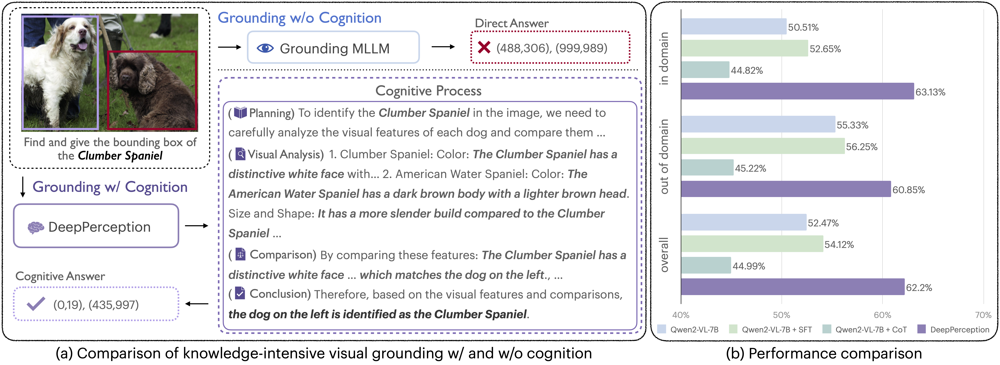

# DeepPerception: Advancing R1-like Cognitive Visual Perception in MLLMs for Knowledge-Intensive Visual Grounding
Xinyu Ma, Ziyang Ding, Zhicong Luo, Chi Chen, Zonghao Guo, Derek F. Wong, Xiaoyi Feng, Maosong Sun

-----

<a href='https://deepperception-kvg.github.io/'></a>
<a href='https://arxiv.org/abs/2503.12797'></a> 
<a href='https://huggingface.co/MaxyLee/DeepPerception'></a> 
<a href='https://huggingface.co/datasets/MaxyLee/KVG-Bench'></a> 
<a href='https://huggingface.co/datasets/MaxyLee/KVG'></a> 

This is the official repository of **DeepPerception**, an MLLM enhanced with cognitive visual perception capabilities.

## Release

- [x] **`2025.03.18`** 🔥Release the DeepPerception evaluation code and model in [`🤗HuggingFace`](https://huggingface.co/MaxyLee/DeepPerception).
- [x] **`2025.03.18`** 🔥DeepPerception Paper has been released in [`📕Arxiv`](https://arxiv.org/abs/2503.12797).

## Overview

<p align="center">
    </a><br>
    Figure 1: (a) <strong>DeepPerception</strong> employs knowledge-driven reasoning to derive answers, while the baseline model directly outputs predictions without cognitive processing. (b) <strong>DeepPerception</strong> demonstrates superior cognitive visual perception capabilities that cannot be elicited in the foundation model through simplistic zero-shot CoT prompting.
</p>

#### Abstract

Human experts excel at fine-grained visual discrimination by leveraging domain knowledge to refine perceptual features, a capability that remains underdeveloped in current Multimodal Large Language Models (MLLMs). Despite possessing vast expert-level knowledge, MLLMs struggle to integrate reasoning into visual perception, often generating direct responses without deeper analysis. 

To bridge this gap, we introduce knowledge-intensive visual grounding (KVG), a novel visual grounding task that requires both finegrained perception and domain-specific knowledge integration. To address the challenges of KVG, we propose **DeepPerception**, an MLLM enhanced with cognitive visual perception capabilities. Our approach consists of (1) an automated data synthesis pipeline that generates high-quality, knowledge-aligned training samples, and (2) a two-stage training framework combining supervised fine-tuning for cognitive reasoning scaffolding and reinforcement learning to optimize perceptioncognition synergy. To benchmark performance, we introduce KVG-Bench, a comprehensive dataset spanning 10 domains with 1.3K manually curated test cases. 

Experimental results demonstrate that DeepPerception significantly outperforms direct fine-tuning, achieving +8.08% accuracy improvements on KVG-Bench and exhibiting +4.60% superior cross-domain generalization over baseline approaches. Our findings highlight the importance of integrating cognitive processes into MLLMs for human-like visual perception and open new directions for multimodal reasoning research.

#### Key Contributions

- We introduce the task of **Knowledge-intensive Visual Grounding (KVG)** to explore the concept of cognitive visual perception for MLLMs, aiming to integrate their inherent knowledge and reasoning capabilities into visual perception.
-  We propose **[DeepPerception](https://huggingface.co/MaxyLee/DeepPerception)**, an MLLM with enhanced cognitive visual perception capabilities. To achieve this, we develop an automated dataset creation pipeline and a two-stage framework integrating supervised cognitive capability enhancement with perception-oriented reinforcement learning.
- We introduce **[KVG-Bench](https://huggingface.co/datasets/MaxyLee/KVG-Bench)**, a manually curated benchmark for the KVG task involving diverse knowledge domains and entities. Experiments on KVG-Bench and other fine-grained visual recognition tasks demonstrate DeepPerception's exceptional cognitive visual perception capabilities and superior cross-domain generalization performance.

## Get Started

### Contents:

- [Environment](#environment)
- [Data Preparation](#data-preparation)
- [Checkpoints](#checkpoints)
- [Evaluation](#evaluation)
- [Training](#training)

### Environment

1. Clone this repository and navigate to DeepPerception folder
```bash
git clone https://github.com/MaxyLee/DeepPerception.git
cd DeepPerception
```
2. Install Packages
For evaluation:
```bash
conda create -n deepperception python=3.9
conda activate deepperception

pip install -r requirements.txt
```

### Data Preparation

| Dataset                             | Links                                  |
|---------                            |---------------------------------------|
| KVG-Bench                           | [`🤗HuggingFace`](https://huggingface.co/datasets/MaxyLee/KVG-Bench)    |
| KVG Training                        | [`🤗HuggingFace`](https://huggingface.co/datasets/MaxyLee/KVG)    |
---

### Checkpoints

| Model                               | Links                                  |
|---------                            |---------------------------------------|
| DeepPerception                      | [`🤗HuggingFace`](https://huggingface.co/MaxyLee/DeepPerception)    |
| DeepPerception-FGVR                 | [`🤗HuggingFace`](https://huggingface.co/MaxyLee/DeepPerception-FGVR)    |
---

### Evaluation

```bash
# Evaluate on KVG-Bench
bash eval.sh [CUDA_IDS] [KVG_BENCH_PATH] [CKPT_PATH]
```
Notice: Please modify the script if you want to evaluate on Qwen2-VL.

### Training

TODO

## Citation

If you find DeepPerception useful for your research or applications, please cite using this BibTeX:

```bibtex
@misc{ma2025deepperception,
      title={DeepPerception: Advancing R1-like Cognitive Visual Perception in MLLMs for Knowledge-Intensive Visual Grounding}, 
      author={Xinyu Ma and Ziyang Ding and Zhicong Luo and Chi Chen and Zonghao Guo and Derek F. Wong and Xiaoyi Feng and Maosong Sun},
      year={2025},
      url={https://arxiv.org/abs/2503.12797}, 
}
```

## Acknowledgement

- [Qwen2-VL](https://github.com/QwenLM/Qwen2.5-VL)
- [vLLM](https://github.com/vllm-project/vllm)
- [LLaMA-Factory](https://github.com/hiyouga/LLaMA-Factory)
- [R1-V](https://github.com/Deep-Agent/R1-V)

## License

[](https://github.com/twbs/bootstrap/blob/main/LICENSE)
[](https://github.com/tatsu-lab/stanford_alpaca/blob/main/LICENSE)
