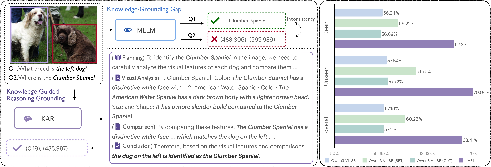

# KARL: Knowledge-Aware Reasoning and Reinforcement Learning for Knowledge-Intensive Visual Grounding

Xinyu Ma∗ , Ziyang Ding∗ , Zhicong Luo, Chi Chen, Zonghao Guo, Xuebo Liu, Derek F. Wong, Zhen Zhao, Xiaoyi Feng, Maosong Sun

<a href='https://deepperception-kvg.github.io/'></a>
<a href='https://arxiv.org/abs/2503.12797'></a> 
<a href='https://huggingface.co/Oscar-dzy/KARL'></a> 
<a href='https://huggingface.co/datasets/MaxyLee/KVG-Bench'></a> 
<a href='https://huggingface.co/datasets/Oscar-dzy/KVG-KARL'></a> 

This is the official repository of **KARL**, an MLLM enhanced with Knowledge-Aware Reinforcement Learning.

## Release

- [x] **`2026.03.28`** 🔥Release the KARL evaluation & training code and model in [`🤗HuggingFace`](https://huggingface.co/Oscar-dzy/KARL).
- [x] **`2026.03.28`** 🔥KARL Paper has been released in [`📕Arxiv`](https://arxiv.org/abs/2503.12797). (TODO)

## Overview

<p align="center">
    </a><br>
Figure 1: (a) While the MLLM can correctly recognize the entity (Q1), it fails to ground it (Q2), revealing an inconsistency between knowledge and grounding. Our method integrates knowledge-guided reasoning to bridge this gap. (b) <strong>KARL</strong> achieves substantially stronger grounding performance than the baseline model and zero-shot CoT prompting, showing that knowledge-guided reasoning for KVG cannot be effectively induced by simple prompting alone.
</p>


### Abstract

Knowledge-Intensive Visual Grounding (KVG) requires models to localize objects using fine-grained, domain-specific entity names rather than generic referring expressions.  Although Multimodal Large Language Models (MLLMs) possess rich entity knowledge and strong generic grounding capabilities, they often fail to effectively utilize such knowledge when grounding specialized concepts, revealing a knowledge–grounding gap between internal knowledge and grounding predictions.  

To address this challenge, we propose a knowledge-aware training paradigm for KVG. Our approach first constructs knowledge-guided reasoning data to encourage models to activate domain-relevant entity knowledge during grounding, and then introduces KARL, a Knowledge-Aware Reinforcement Learning framework that adaptively modulates reward signals according to the model’s estimated knowledge mastery of different entities. To facilitate systematic evaluation, we introduce KVG-Bench, a benchmark spanning 10 domains with 1.3K curated test cases covering 531 images and 882 entities. 

Extensive experiments show that our approach consistently outperforms a wide range of baseline models and achieves substantially stronger cross-domain generalization on unseen categories.

### Key Contributions

- We introduce Knowledge-Intensive Visual Grounding (KVG) task and KVG-Bench, a benchmark designed to evaluate models’ ability to leverage domain-specific entity knowledge for visual grounding. Our empirical observations suggest the presence of a knowledge–grounding gap in current MLLMs.
-  We propose a knowledge-guided reasoning training strategy that constructs CoT reasoning data to encourage models to explicitly activate and align entity-level knowledge with visual evidence during grounding, differing from recent reasoning-guided grounding approaches that primarily emphasize structured reasoning depth.
- We present KARL, a Knowledge-Aware Reinforcement Learning framework that dynamically modulates optimization signals according to entity-level knowledge mastery rather than applying uniform reward schemes. This design promotes more balanced optimization across entities with heterogeneous knowledge levels and leads to improved generalization in knowledge-intensive grounding.

## Get Started

### Contents:

- [Environment](#environment)
- [Data Preparation](#data-preparation)
- [Checkpoints](#checkpoints)
- [Evaluation](#evaluation)
- [Training](#training)

### Environment

1. Clone this repository and navigate to DeepPerception folder

```bash
git clone https://github.com/MaxyLee/DeepPerception.git
cd DeepPerception/KARL
```

2. Install packages for evaluation:

```bash
conda create -n karl python==3.12
conda activate karl

pip install -r requirements.txt
```

3. Download the flash attention file in this link: https://github.com/Dao-AILab/flash-attention/releases/download/v2.8.1/flash_attn-2.8.1+cu12torch2.8cxx11abiFALSE-cp312-cp312-linux_x86_64.whl. The run the following command:

```bash
pip install /path/to/flash_attn-2.8.1+cu12torch2.8cxx11abiFALSE-cp312-cp312-linux_x86_64.whl
```


### Data Preparation

| Dataset      | Links                                                        |
| ------------ | ------------------------------------------------------------ |
| KVG-Bench    | [`🤗HuggingFace`](https://huggingface.co/datasets/MaxyLee/KVG-Bench) |
| KVG Training | [`🤗HuggingFace`](https://huggingface.co/datasets/Oscar-dzy/KVG-KARL) |

---

### Checkpoints

| Model | Links                                                   |
| ----- | ------------------------------------------------------- |
| KARL  | [`🤗HuggingFace`](https://huggingface.co/Oscar-dzy/KARL) |

---

### Evaluation

In `karl/eval/eval.sh`, configure the following:

- `GPU_IDs`: the GPU IDs to use
- `DATA_PATH`: the path to KVG-Bench
- `CKPT`: the path to the Qwen3-VL model
- `OUT_DIR`: the output directory for evaluation results

Also，in `karl/eval/evaluate.py`, you need to configure `seen_train_entities_path`, `visual_knowledge_path` , `visual_knowledge_ood_path` and `visual_knowledge_test_ood_path` to point to the corresponding JSON files in the dataset directory KVG-KARL/knowledge [[`🤗HuggingFace`](https://huggingface.co/datasets/Oscar-dzy/KVG-KARL)].

Then，run the command:

```bash
# Evaluate on KVG-Bench
bash eval.sh
```

### Training

KARL uses a two-stage training framework:

#### Stage 1: CoT-SFT

**Environment Setup**:

Please clone the following repository and follow the instructions to set up the training environment: https://github.com/hiyouga/LLaMA-Factory.

We recommend creating a new conda environment specifically for this stage to avoid potential package version conflicts.

```bash
conda create -n cot-sft python=3.10.0
conda activate cot-sft
```

You may also use the provided `karl/train/sft/requirements.txt` file as a quick reference and install the LLaMA-Factory source code under `/path/to/LLaMA-Factory` :

```bash
cd karl/train/sft
pip install -r requirements.txt

cd /path/to/LLaMA-Factory
pip install -e .
```

Tips: Additionally, you can also set up the environment by following the installation guide of [LLaMA-Factory](https://github.com/hiyouga/LlamaFactory?tab=readme-ov-file#installation).

**Data Preparation**:

1. Download the training data from [`🤗KVG-KARL`](https://huggingface.co/datasets/Oscar-dzy/KVG-KARL) and unzip `images.zip`.
2. Configure dataset in `LLaMA-Factory/data/dataset_info.json`:

```json
"kvg-*": {
    "file_name": "path/to/cot-sft-*.json",
    "formatting": "sharegpt",
    "columns": {
      "messages": "messages",
      "images": "images"
    },
    "tags": {
      "role_tag": "role",
      "content_tag": "content",
      "user_tag": "user",
      "assistant_tag": "assistant"
    }
},
...
```

- Replace `"path/to/cot-sft-*.json"` with the actual path to your downloaded JSON files

- Update image paths in the JSON files to point to your local unzipped `images` directory

**Training**:

Follow these steps to launch the training:

1. Open `qwen3vl_full_sft_rec.yaml` (located in `karl/train/sft`) and update these critical paths:

```yaml
# Example configuration snippet
model_name_or_path: /path/to/your/checkpoint/Qwen3-VL-8B-Instruct  # Update Qwen3-VL-8B-Instruct location
output_dir: /path/to/your/output/directory      # Update output checkpoint directory
deepspeed: ...
```

```bash
# Navigate to LLaMA-Factory root directory
cd /path/to/LLaMA-Factory

# Set GPU visibility (adjust based on your GPU setup)
export CUDA_VISIBLE_DEVICES=0,1,2,3,4,5,6,7

# Launch distributed training
FORCE_TORCHRUN=1 llamafactory-cli train /path/to/qwen3vl_full_sft_rec.yaml
```

#### Stage 2: Knowledge-Aware GRPO

Please follow the link to train using Knowledge-Aware GRPO: https://github.com/Oscar-dzy/KARL-verl

## Citation

If you find KARL useful for your research or applications, please cite using this BibTeX: (TODO)

```bibtex

```

## Acknowledgement

- [Qwen3-VL](https://github.com/QwenLM/Qwen3-VL)
- [vLLM](https://github.com/vllm-project/vllm)
- [LLaMA-Factory](https://github.com/hiyouga/LLaMA-Factory)
- [verl](https://github.com/verl-project/verl)

## License

[](https://github.com/twbs/bootstrap/blob/main/LICENSE)
[](https://github.com/tatsu-lab/stanford_alpaca/blob/main/LICENSE)